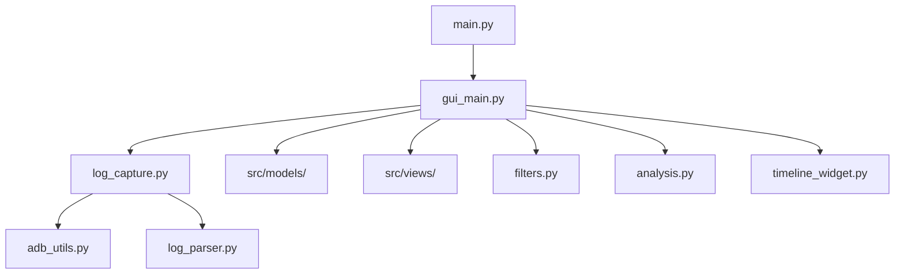

# Android Log Monitor Pro 🚀

A professional, cross-platform desktop GUI application designed for real-time Android device log monitoring and analysis via ADB. Built with Python and PyQt6, this tool offers advanced filtering, session statistics, and a visual timeline to streamline your debugging workflow.


*Tip: Replace this with an actual screenshot of your application!*

## ✨ Key Features

- **Real-time Log Capture**: Seamlessly stream logs from connected Android devices via ADB.
- **Advanced Filtering System**:
    - Filter by Log Levels (Verbose, Debug, Info, Warn, Error, Fatal).
    - Tag-based filtering and exclusion.
    - Process ID (PID) filtering for specific application debugging.
    - Keyword search with high-speed regex support.
- **Smart Statistics Dashboard**:
    - Live tracking of total logs, error counts, and logs per second.
    - Session duration monitoring.
    - Automatic identification of "Top Tags" and "Top Errors".
- **Visual Timeline**: Interactive timeline widget to visualize log density and events over time.
- **Profile Management**: Save and load custom filter presets to quickly switch between different debugging scenarios.
- **Cross-Platform**: Runs on Windows, macOS, and Linux.
- **Modern UI**: Sleek, high-performance interface with a premium dark theme.
- **Data Export**: Export your analyzed logs to CSV or JSON formats for further review.

## 🛠️ Tech Stack

- **Language**: Python 3.10+
- **GUI Framework**: PyQt6
- **Device Communication**: Android Debug Bridge (ADB)
- **Monitoring**: Watchdog & Psutil

## 🚀 Getting Started

### Prerequisites

1. **Python 3.10+**: Ensure you have Python installed.
2. **ADB (Android Debug Bridge)**: Must be installed and available in your system's PATH.
    - [Download SDK Platform Tools](https://developer.android.com/studio/releases/platform-tools)

### Installation

1. Clone the repository:
   ```bash
   git clone https://github.com/your-username/android-log-analyzer.git
   cd android-log-analyzer
   ```

2. Install dependencies:
   ```bash
   pip install -r requirements.txt
   ```

### Usage

1. Connect your Android device via USB or WiFi (ensure USB Debugging is enabled).
2. Launch the application:
   ```bash
   python main.py
   ```
3. Select your device from the dropdown and click **Start Capture**.

## 🏗️ Project Architecture



## 🤝 Contributing

Contributions are welcome! If you have suggestions for new features or bug fixes, please open an issue or submit a pull request.

1. Fork the Project
2. Create your Feature Branch (`git checkout -b feature/AmazingFeature`)
3. Commit your Changes (`git commit -m 'Add some AmazingFeature'`)
4. Push to the Branch (`git push origin feature/AmazingFeature`)
5. Open a Pull Request

## 📄 License

Distributed under the MIT License. See `LICENSE` for more information.

=======

